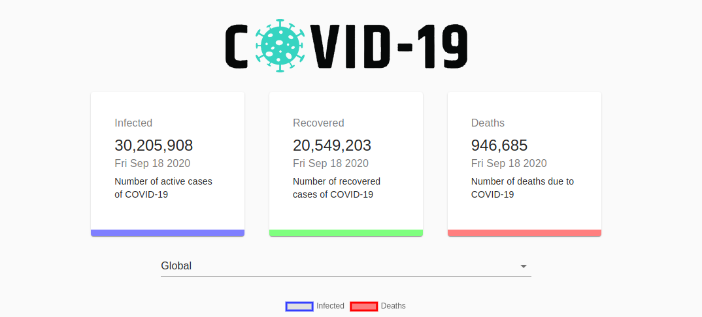
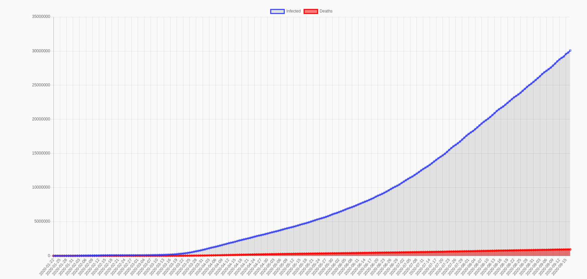

# Covid Tracker

## About the App

In this time of pandemic we all are given an opportunity to do something with our time and resources available to us. Henceforth this app was made using React with hooks. With all modern coding conventions and practices

## Screenshots

	
Data Count

---

	
Data Chart

## Extras used

 - Matertial-UI for react
 - API - https://covid19.mathdro.id/api
 - Chartjs - https://www.chartjs.org/